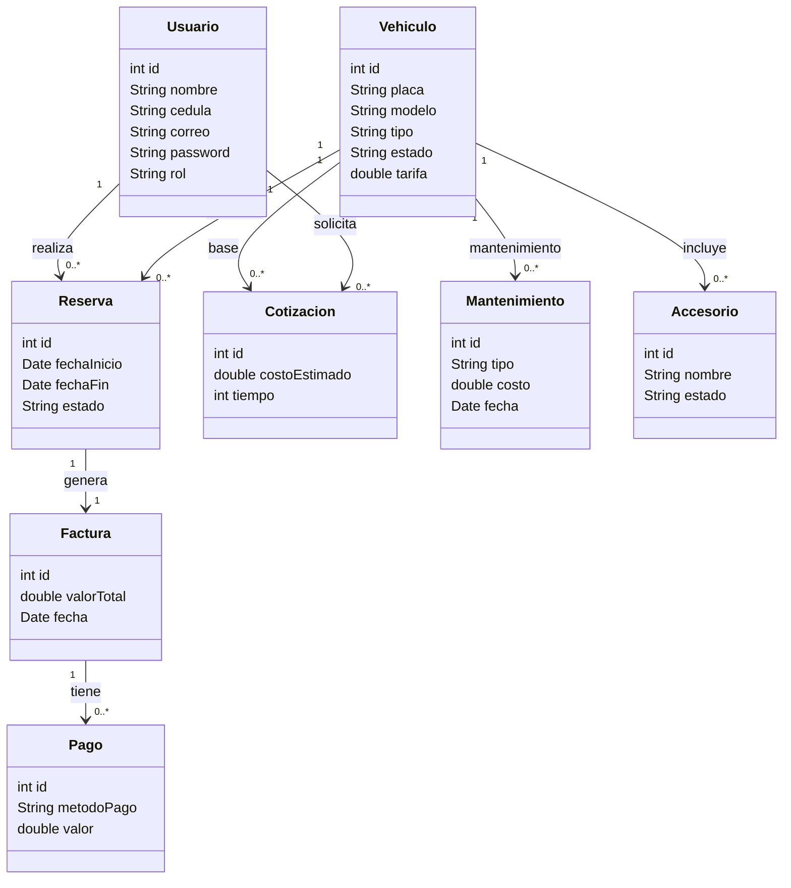

# RENTA FACIL


## Sistema de gestión de renta de vehículos - proyecto integrador

RentaFácil es un sistema de información web diseñado para transformar la gestión de alquiler de vehículos en Cali, pasando de procesos manuales propensos a errores hacia una administración digital integrada El proyecto se enfoca en resolver la falta de control en la disponibilidad de flota y las dificultades en la generación de cotizaciones y facturas mediante una herramienta robusta y escalable.

---

## Entidades del sistema

El sistema de gestión de alquiler de vehículos está compuesto por las siguientes entidades principales:

### Usuario
Representa a las personas que interactúan con el sistema.

Atributos:
- id
- nombre
- cédula
- correo
- contraseña
- rol (Cliente, Administrador, Empleado)

---

### Vehículo
Contiene la información de los vehículos disponibles para alquiler.

Atributos:
- id
- placa
- modelo
- tipo
- estado (Disponible, Reservado, Alquilado, Mantenimiento)
- tarifa

---

### Reserva
Gestiona las solicitudes de alquiler realizadas por los usuarios.

Atributos:
- id
- usuario_id
- vehiculo_id
- fecha_inicio
- fecha_fin
- estado

---

### Cotización
Permite calcular el costo estimado del alquiler de un vehículo.

Atributos:
- id
- vehiculo_id
- tiempo
- costo_estimado

---

### actura
Representa el registro del cobro generado por un servicio de alquiler.

Atributos:
- id
- reserva_id
- valor_total
- fecha

---

### Pago
Registra los pagos realizados por los usuarios.

Atributos:
- id
- factura_id
- metodo_pago
- valor

---

### Mantenimiento
Controla los mantenimientos preventivos y correctivos de los vehículos.

Atributos:
- id
- vehiculo_id
- tipo
- costo
- fecha

---

### Accesorios (Opcional)
Permite gestionar los accesorios asociados a los vehículos.

Atributos:
- id
- vehiculo_id
- nombre
- estado


## Diagrama de Clases




## Tecnologías utilizadas

- **Lenguaje de programación:** Javascript
- **Base de datos:** MySQL
- **Gestor de base de datos:** MySQL Workbench
- **Control de versiones:** Git y GitHub
- **Metodología:** Prototipado

---

## Estructura del proyecto

El proyecto está organizado bajo una arquitectura por capas:


```text
src/
│
├── modelo/
│   ├── Usuario.java
│   ├── Vehiculo.java
│   ├── Reserva.java
│   ├── Factura.java
│   ├── Pago.java
│
├── controlador/
│   ├── ControladorUsuario.java
│   ├── ControladorReserva.java
│   ├── ControladorVehiculo.java
│
├── vista/
│   ├── VistaLogin.java
│   ├── VistaMenu.java
│
├── util/
│   ├── ConexionBD.java
│
└── Main.java
```

---

## Conexión a la base de datos

El sistema utiliza una base de datos relacional en **MySQL** para almacenar la información de usuarios, vehículos, reservas, facturación y demás procesos.

La conexión se realiza mediante **JDBC (Java Database Connectivity)**, permitiendo la comunicación entre la aplicación desarrollada en  Javascript y la base de datos.

---

## Parámetros de conexión

- Motor de base de datos: MySQL  
- Nombre de la base de datos: renta_facil  
- Puerto: 3306  
- Usuario: root  
- Contraseña: (configurable según el entorno)


---

## Integrantes
- Luis Alberto Fernandez Viveros
- Gisela Andrade Murillo
- Michelle Dayanna Duque Marín
- Ana Yiseth Solarte

## Grupo
- 411

